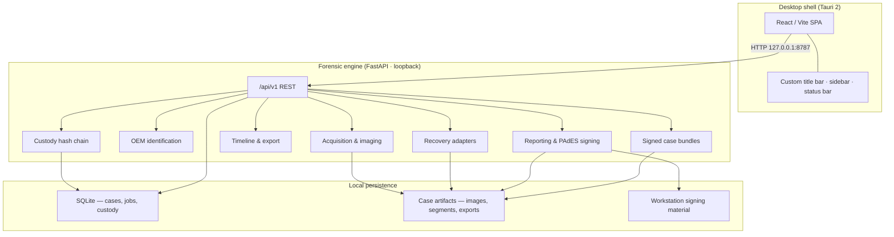

# Pramaan

**Multi-vendor DVR/NVR forensic workstation** — Smart India Hackathon 2026 · **SIH26150** · National Technical Research Organisation (NTRO)

| | |
|---|---|
| **Problem ID** | SIH26150 |
| **Theme** | Blockchain & Cybersecurity |
| **Organisation** | National Technical Research Organisation (NTRO) |
| **Version** | 0.6.0 |
| **Platform** | Windows desktop (Tauri 2 + local Python engine) |

---

## Problem statement (SIH26150)

**Title:** Development of a Multi-Vendor DVR/NVR Forensic Analysis Tool for Standardized Acquisition, Recovery, and Analysis of Surveillance Evidence.

**Background:** Digital and network video recorders are deployed across government, law enforcement, critical infrastructure, and commercial sites. Manufacturers including Dahua, CP Plus, Honeywell, TP-Link, Godrej, Uniview, Hikvision, and Matrix use proprietary storage layouts, metadata encodings, and video containers. Investigators therefore depend on multiple vendor-specific tools, which increases handling time, produces inconsistent results, complicates timestamp alignment across cameras, and weakens chain-of-custody discipline.

**Requirement:** A single vendor-agnostic forensic platform that acquires recorder media, identifies the OEM storage family, recovers deleted or overwritten footage where technically possible, normalises multi-channel timelines, maintains hash-linked custody and audit logging, and produces standardised forensic reports — across the named OEM ecosystem with optional intelligent analytics on recovered sequences.

Official reference: [SIH Buddy — SIH26150](https://sih-buddy.vercel.app/ps/SIH26150) · [sih.gov.in](https://sih.gov.in)

---

## Project brief

Pramaan is a **local, offline forensic workstation** that unifies the investigation lifecycle for DVR/NVR evidence inside a **case-centric workspace**. An examiner creates or opens a case, imports disk images (E01, DD, IMG, RAW, BIN) or a signed case export, runs OEM identification, executes tiered recovery adapters, reviews a multi-channel timeline with playback, applies optional scene and face analytics on recovered clips, verifies chain of custody, and exports PAdES-signed PDF reports and signed case bundles for transfer between workstations.

The product is designed for **examiner-operated lab workflows** and SIH demonstration: dense operate-mode UI, explicit workflow gating (acquisition → identification → recovery → timeline → findings → report), and engine feedback during hashing, carving, and export. No cloud dependency; all processing stays on the workstation.

**Validation scope:** Dahua, Hikvision, and Honeywell parsers are **experimental** — proven on in-repo known-answer fixtures and optional public corpora (Digital Corpora E01, CAVIAR). They are **not field-validated** on independent recorder disk images. CP Plus, TP-Link, Godrej, Matrix, and Uniview are acquisition plus generic analysis unless matching family signatures route to an experimental adapter. See [docs/VALIDATION-REPORT.md](docs/VALIDATION-REPORT.md) and [docs/CAPABILITIES-AND-LIMITATIONS.md](docs/CAPABILITIES-AND-LIMITATIONS.md).

---

## Architecture



**Trust boundary:** The engine binds to loopback. The UI proxies API calls through Vite in development and through the Tauri webview in production. Case data, evidence files, custody records, and signing keys remain under `FORENSIC_WORKSTATION_DATA` (default `.localdata/` in development).

---

## Repository layout

```
src/                 React workstation UI (TypeScript, Vite)
src-tauri/           Tauri 2 desktop shell, capabilities, CSP
engine/              Python FastAPI forensic engine + pytest suite
  app/api/v1/        Versioned REST surface (/api/v1 only)
  app/parsers/       OEM adapters (Dahua DHAV, Hikvision HKVI, Honeywell, Tier 2)
  app/services/      Acquisition, recovery, timeline, reporting, bundles
  app/core/          Config, SQLite, repository, signing
validation_data/     Tier-1 known-answer fixtures, ONNX models, manifest
scripts/             Build, validation, smoke, and asset-fetch tooling
docs/                Release documentation (operations, validation, legal appendix)
run.py               Backend-only dev launcher (API testing)
desktop.py           SAC-safe pywebview launcher (Windows)
```

---

## Capabilities delivered

### Case workspace
- Investigation registry with examiner identity, reference notes, and filtered case list
- **Import** from the registry: disk images (E01, DD, IMG, RAW, BIN) are normalized on ingest; `.zip` restores a signed case export from another Pramaan workstation
- Guided workflow sidebar: Overview → Acquisition → Identification → Recovery → Timeline → Findings → Custody → Report
- Case export/import via signed bundles (`.pramaan.zip` filename on export; any valid signed `.zip` on import) with per-file SHA-256 verification

### Acquisition
- File upload with size limits and SHA-256 sidecars
- Chunked physical imaging with checkpoints, resume, bad-sector maps, and destination rehash
- E01 input via optional `libewf-python`
- Operator OEM drop folder (`PRAMAAN_OEM_IMAGE_DIR`, default `validation_data/oem`)
- Optional logical network acquisition when `PRAMAAN_ALLOW_LOGICAL_ACQUIRE=1`

### Identification & recovery
- Byte-marker OEM fingerprinting across eight named vendors (Dahua, Hikvision, Honeywell, CP Plus, TP-Link, Godrej, Uniview, Matrix)
- Dedicated parser paths: Dahua DHAV dual-signature, Hikvision HKVI blocks, Honeywell partition/index/carve
- Generic Tier 2: filesystem undelete (pytsk3 / FAT walk) and H.264 carving fallback
- Background recovery jobs with SSE progress streaming

### Timeline & playback
- Per-device multi-channel timeline from recovered segments
- Synchronised playback deck with export-to-MP4 (FFmpeg when available)
- Drift calibration endpoint for wall-clock alignment workflows

### Integrity & custody
- Append-only custody log with SHA-256 hash chaining and evidence digest binding
- Custody verification gate on standard report generation
- Integrity report path for tamper documentation

### Reporting & transfer
- JSON, HTML, and PAdES-signed PDF forensic reports
- Workstation certificate fingerprint in Settings (copy for PDF signature verification)
- RSA-PSS signed manifests on case bundles; import rejects traversal, hash mismatch, and signature failure

### Validation & lab tooling
- Optional **parser sanity check** in Settings (OEM fixture pipeline; signed HTML/PDF report)
- Known-answer tier-1 specimens for Dahua, Hikvision, and Honeywell (`validation_data/fixtures/`)
- Public corpora fetch: Digital Corpora E01, CAVIAR Walk1, optional FAT32 raw (`scripts/fetch_validation_assets.py`)
- Disk-shaped OEM lab images for drop-zone testing (`scripts/build_oem_disk_fixtures.py`)
- Operator field captures: place real DVR dumps in `validation_data/oem/` or set `PRAMAAN_OEM_IMAGE_DIR`

### Security hardening
- Optional `PRAMAAN_API_TOKEN` for API authentication
- Tauri CSP and scoped filesystem capabilities
- Outbound socket guard (disabled when logical acquisition is explicitly enabled)

---

## Novelty

1. **Unified case model** — One workstation spans acquisition, OEM routing, recovery, timeline, analytics, custody, and signed reporting; commercial DVR tools are typically siloed and closed.
2. **Adapter registry architecture** — Pluggable parsers with explicit tiering (vendor-specific → filesystem → carve) instead of a single monolithic carver.
3. **Hash-chained custody integrated with reporting** — Custody events bind to evidence digests; standard reports require an intact chain before PDF signing.
4. **Signed portable case bundles** — Manifest + embedded certificate + per-artifact hashes for lab-to-lab transfer with verification on import.
5. **Desktop-native forensic UX** — Operate-mode density, workflow gating, and live job feedback rather than a generic dashboard template.
6. **Offline-first engineering** — Engine, evidence, and signing material remain local; suitable for air-gapped lab deployment.

---

## Technology stack

| Layer | Technologies |
|-------|----------------|
| Desktop shell | Tauri 2, Rust, WebView2 |
| Frontend | React 18, TypeScript, Vite, React Router, Tailwind CSS, Sonner, cmdk |
| Forensic engine | Python 3.11+, FastAPI, Uvicorn, SQLite (WAL) |
| Parsing & media | construct, pytsk3, pyewf (optional), FFmpeg (optional) |
| Signing | cryptography, pyHanko (PAdES PDF) |
| Analytics | OpenCV (Haar / optional YuNet ONNX), FFmpeg scene detection |
| Build & CI | PyInstaller sidecar, GitHub Actions, NSIS/MSI packaging |
| Validation | pytest, unittest, smoke scripts, Digital Corpora fixtures |

---

## Quick start

### Desktop application (recommended)

```powershell
npm install
npm run tauri:dev
```

Starts Vite on port 5173, spawns the engine on `127.0.0.1:8787`, and opens the Tauri window.

**Windows SAC-safe shortcut** (no local `tauri build` required):

```powershell
powershell -ExecutionPolicy Bypass -File scripts/install-pramaan-desktop.ps1
```

### Backend-only (API / tests)

```bash
pip install -r engine/requirements.txt
python run.py
```

### Frontend-only (browser against running engine)

```bash
python run.py          # terminal 1
npm run dev            # terminal 2 → http://localhost:5173
```

---

## Configuration

| Variable | Purpose |
|----------|---------|
| `FORENSIC_WORKSTATION_DATA` | Root data directory (cases, DB, reports, signing) |
| `PRAMAAN_OEM_IMAGE_DIR` | Operator OEM image drop folder |
| `PRAMAAN_API_TOKEN` | Optional API authentication token |
| `PRAMAAN_ALLOW_LOGICAL_ACQUIRE` | Set `1` to enable logical network acquisition |
| `FORENSIC_FFMPEG` | Path to FFmpeg binary for MP4 export |
| `FORENSIC_MAX_UPLOAD_BYTES` | Upload size cap (default 8 GiB) |

Development default data path: `.localdata/` at repository root (gitignored).

---

## Verification

```bash
python -m pytest engine/tests -q
python scripts/verify_p0.py
python scripts/smoke_test.py
npm run build
```

Optional public-media sync:

```bash
python scripts/fetch_validation_assets.py --real-fs --surveillance
python scripts/build_oem_disk_fixtures.py
python scripts/test_public_media.py   # requires engine on :8787
```

---

## API

All clients use **`/api/v1/*`**. Service health and capability discovery: `GET /api/v1/version`.

---

## Documentation

| Document | Description |
|----------|-------------|
| [docs/ARCHITECTURE.md](docs/ARCHITECTURE.md) | Data flow and trust boundaries |
| [docs/USER-MANUAL.md](docs/USER-MANUAL.md) | Examiner procedures |
| [docs/OPERATIONS-SOP.md](docs/OPERATIONS-SOP.md) | Lab operations |
| [docs/VALIDATION-REPORT.md](docs/VALIDATION-REPORT.md) | Test evidence matrix |
| [docs/SIH26150-AUDIT.md](docs/SIH26150-AUDIT.md) | Release audit record |
| [docs/DESKTOP.md](docs/DESKTOP.md) | Packaging and SAC-safe install |
| [DEVIATIONS.md](DEVIATIONS.md) | Implementation deviation log |

---

## Version bump

```bash
npm run version:bump -- 0.7.0
```

Updates `engine/app/__init__.py`, `package.json`, and `src-tauri/tauri.conf.json` in sync.

---

## License

See repository license file. Third-party notices: [docs/THIRD-PARTY-NOTICES.md](docs/THIRD-PARTY-NOTICES.md).
