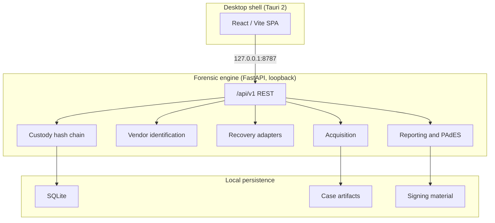

# Pramaan

Multi-vendor DVR and NVR forensic workstation. A local, offline, case-centric
tool for acquiring, identifying, recovering, reviewing, and reporting on
surveillance video evidence from recorders that use proprietary storage layouts.

| | |
|---|---|
| Version | 0.6.0 |
| Platform | Windows desktop (Tauri 2 shell + local Python engine) |
| Engine | FastAPI on 127.0.0.1:8787, SQLite, local artifact store |
| UI | React / Vite single-page app |

---

## Overview

Investigators normally need several vendor-specific tools because Dahua,
CP Plus, Honeywell, TP-Link, Godrej, Uniview, Hikvision, and Matrix each use
their own on-disk format. Pramaan brings acquisition, vendor identification,
recovery, timeline review, optional analytics, a hash-chained custody log, and
signed reporting into one workstation that runs entirely on the examiner's
machine with no network dependency.

### Validation scope

Read this before relying on a result.

- The Dahua DHAV, Hikvision HIKBTREE/MPEG-PS, and Honeywell parsers are
  **experimental**. They are proven against in-repo fixtures, an optional
  PRONOM `.dav` sample, and Digital Corpora E01 undelete
  (`nps-2009-canon2`, at least 6 deleted root-directory entries via
  `generic_tier2`). They are **not** field-validated against independent
  recorder disks.
- CP Plus, TP-Link, Godrej, Matrix, and Uniview run acquisition plus generic
  analysis unless a family byte signature routes them to an experimental
  adapter.
- The generic filesystem-undelete pass reads the filesystem root directory
  only. Subdirectories are not walked.
- Analytics findings and cross-camera matches are investigative leads, not
  identification evidence.

Fetch public corpora with `scripts/validation/fetch_validation_assets.py`.
Place operator field captures in `validation_data/oem/` (gitignored).

---

## Quick start

### Desktop (recommended)

```powershell
npm install
pip install -r engine/requirements.txt
npm run tauri:dev
```

Starts Vite on `:5173`, the engine on `127.0.0.1:8787`, and opens the Tauri
window.

**SAC-safe path** (when local `tauri build` is blocked by Windows Application
Control):

```powershell
pip install -r requirements-desktop.txt
powershell -ExecutionPolicy Bypass -File scripts/dev/run-desktop-sac-safe.ps1
# or double-click desktop.ps1
```

### Backend only

```powershell
pip install -r engine/requirements.txt
python run.py
```

### Browser UI against a running engine

```powershell
python run.py          # terminal 1
npm run dev            # terminal 2, then open http://localhost:5173
```

---

## Examiner workflow

1. **Create or import a case.** Registry, then New case, or Import a disk image
   (E01, DD, IMG, RAW, BIN) or a signed case export (`.zip` from another
   Pramaan workstation).
2. **Acquire evidence.** Upload, OEM drop folder, physical imaging, or optional
   logical network acquire (`PRAMAAN_ALLOW_LOGICAL_ACQUIRE=1`).
3. **Identify.** Review vendor hits, signal strength, filesystem hints, and the
   recovery method the engine routed to. A byte-signature match is a routing
   hint, not proof. Model, serial, and firmware are not available from a
   signature scan. An exported clip has no recorder filesystem, so disk-level
   hints and the recovery hand-off do not apply to it.
4. **Recover.** Run a recovery job and monitor progress over server-sent
   events. Every recovered row shows its kind (recording, carve, or filesystem
   undelete), a human validation label, and its byte range. A filesystem
   undelete run states its root-directory scope on screen.
5. **Timeline and playback.** Multi-channel timeline, MP4 export when FFmpeg is
   present, optional recorder-clock drift calibration.
6. **Findings.** Optional motion, scene-change, face-candidate, and object
   analytics plus bounding-box proximity flags. Investigative aids only; human
   review required, never asserted as fact.
7. **Cross-camera trace.** Correlate the same person across every recovered
   channel and imported clip in the case, by appearance and by face when a face
   is large enough in frame. Upload a reference photo to search a completed
   run.
8. **Custody.** Append-only SHA-256 hash chain with evidence-digest binding.
9. **Report.** JSON, HTML, or PAdES-signed PDF. The standard report is blocked
   when the custody chain is broken.
10. **Transfer.** Export a signed case bundle. Importing it on another
    workstation verifies the manifest signature and every file hash.

### Failure handling

| Symptom | Action |
|---------|--------|
| Port 8787 in use | Stop the stale engine process |
| E01 rejected | Install `libewf-python`, or provide raw / DD |
| No vendor hit | Use the generic Tier 2 path and document the limitation |
| Verification mismatch | Quarantine the copy. Do not continue on a bad hash |
| No recovered segments | Check the adapter and scan scope. This is not proof of absence |

---

## Architecture



**Trust boundary.** The engine binds to loopback only. Data lives under
`FORENSIC_WORKSTATION_DATA` (default `.localdata/` in development,
`%USERPROFILE%\ForensicWorkstation\data` on Windows). A software read-only open
is not a hardware write blocker.

**Data flow.** Case created, image acquired with MD5 and SHA-256, vendor
detection over the first 64 MiB, adapter scan, sequences placed on the
timeline, custody-verified report, optional signed bundle export and import.

---

## Vendor support matrix

| Vendor | Level | Route | Note |
|--------|-------|-------|------|
| Dahua | Experimental parser | `dahua_dhav` | FFmpeg DHAV frame carver; fixture plus optional PRONOM `.dav` (`--real-dvr`) |
| Hikvision | Experimental parser | `hikvision` | HIKBTREE index plus MPEG-PS blocks; fixture-tested |
| Honeywell | Experimental parser | `honeywell` | Expired-index heuristic; fixture-tested |
| CP Plus | Generic, signature route | `dahua_dhav` when DHAV / DHFS signatures present | Hypothesis only |
| Uniview | Generic, signature route | `hikvision` when HIKBTREE signatures present | Hypothesis only |
| TP-Link, Godrej, Matrix | Acquisition plus generic | `generic_tier2` | pytsk3 undelete or H.264 carve; E01 via pyewf |

**Known limitations.** No encryption, RAID, or chip-off support. Certificates
for the signed PDF and bundle are self-signed by default; use an organisation
PKI for production. The custody actor is client-supplied; bind it to an
examiner session in a hardened deployment. Appearance matching needs roughly
480p or better source footage. Face matching only works on frames where a face
is large enough to resolve.

---

## Configuration

| Variable | Purpose |
|----------|---------|
| `FORENSIC_WORKSTATION_DATA` | Root data directory |
| `PRAMAAN_OEM_IMAGE_DIR` | OEM image drop folder (default `validation_data/oem`) |
| `PRAMAAN_API_TOKEN` | Optional API auth token |
| `PRAMAAN_ALLOW_LOGICAL_ACQUIRE` | Set `1` to enable logical network acquisition |
| `FORENSIC_FFMPEG` | FFmpeg path for MP4 export |
| `FORENSIC_MAX_UPLOAD_BYTES` | Upload cap (default 8 GiB) |

---

## Validation and testing

```powershell
pip install -r engine/requirements-dev.txt   # adds pytest and httpx on top of the runtime deps
python -m pytest engine/tests -q
python scripts/validation/verify_p0.py
python scripts/validation/smoke_test.py       # engine must be running
npx tsc --noEmit
npm run build
python scripts/validation/check_routes.py
```

**Fetch public corpora** (Digital Corpora E01, CAVIAR, tier-1 fixtures,
optional PRONOM Dahua `.dav`):

```powershell
python scripts/validation/fetch_validation_assets.py --real-fs --surveillance
python scripts/validation/fetch_validation_assets.py --real-dvr   # optional PRONOM .dav
python scripts/validation/build_oem_disk_fixtures.py
python scripts/validation/test_public_media.py   # engine on :8787
```

Settings, then **Validation datasets**, can fetch individual manifest entries
without the CLI.

Place real DVR field captures in `validation_data/oem/` (gitignored) or set
`PRAMAAN_OEM_IMAGE_DIR`.

**CI.** GitHub Actions runs the engine tests (Linux, Windows, macOS), the
frontend build, an API smoke test, the PyInstaller sidecar build, and the Tauri
Windows installers on `main`.

---

## Desktop install and packaging

| Path | Command |
|------|---------|
| pywebview (SAC-safe) | `scripts/dev/run-desktop-sac-safe.ps1` |
| Browser plus engine | `scripts/dev/run-desktop-sac-safe.ps1 -Mode browser` |
| Tauri dev | `npm run tauri:dev` |
| Install dependencies once | `npm run desktop:install` |
| Build the engine sidecar | `npm run package:engine:windows` |
| Build installers | `npm run package:windows` |

**CI installers.** Push a `v*` tag or run the workflow manually, then download
the `pramaan-windows-installers` artifact.

Authenticode signing runs when the `WINDOWS_CERTIFICATE_BASE64` and
`WINDOWS_CERTIFICATE_PASSWORD` secrets are configured. Otherwise the artifacts
are unsigned.

---

## Repository layout

```
src/                      React workstation UI
src-tauri/                Tauri 2 shell, capabilities, CSP
engine/                   Python FastAPI forensic engine
  app/api/v1/             REST surface (/api/v1 only)
  app/parsers/            Vendor adapters plus Tier 2
  app/services/           Acquisition, recovery, reporting
  tests/                  pytest suite
validation_data/          Fixtures, manifest, optional downloads
docs/reference/           HIKBTREE layout notes, vendored dhav.c
scripts/
  build/                  PyInstaller, Tauri, signing, release
  dev/                    SAC-safe launcher, install helper, version bump
  validation/             Smoke tests, corpora fetch, route check
run.py                    Backend dev launcher
desktop.py                pywebview SAC-safe launcher
```

---

## API

All clients use `/api/v1/*`. Health check: `GET /api/v1/version`.

---

## Third-party licenses (summary)

Direct dependencies include FastAPI, Uvicorn, Pydantic, construct,
cryptography, pyHanko, ReportLab, pytsk3, React, Tauri, Vite, Tailwind, and
bundled ONNX models (YOLOX, YuNet, person_reid_youtu, SFace, all OpenCV Zoo or
Apache-2.0 tooling; fetched on demand, not committed). Full license texts live
in each package's repository and installed metadata. Redistribute only after
completing your own license review.

---

## Version bump

```bash
npm run version:bump -- 0.7.0
```

Syncs `engine/app/__init__.py`, `package.json`, and
`src-tauri/tauri.conf.json`.

---

## License

See the repository license file when present. Distribution requires an approved
project license and complete third-party notices.
