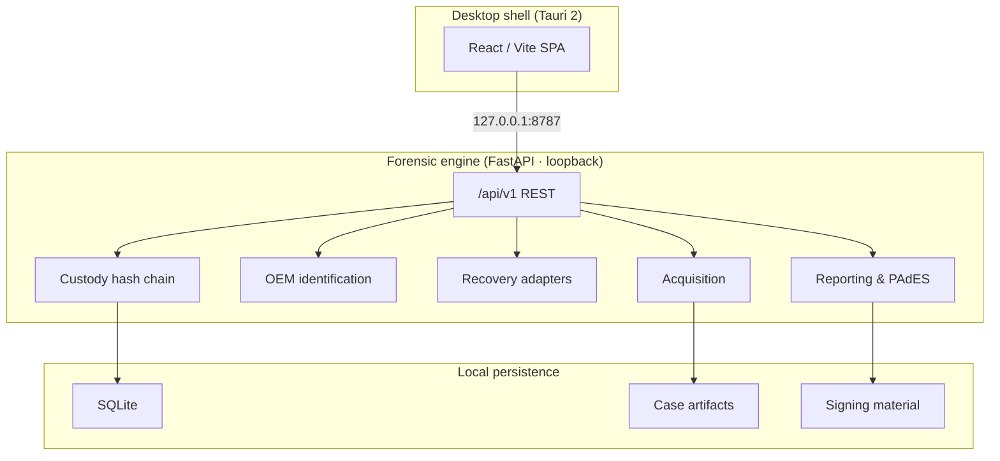

# Pramaan

**Multi-vendor DVR/NVR forensic workstation** — Smart India Hackathon 2026 · **SIH26150** · National Technical Research Organisation (NTRO)

| | |
|---|---|
| **Problem ID** | SIH26150 |
| **Theme** | Blockchain & Cybersecurity |
| **Organisation** | NTRO |
| **Version** | 0.6.0 |
| **Platform** | Windows desktop (Tauri 2 + local Python engine) |

Official reference: [SIH Buddy — SIH26150](https://sih-buddy.vercel.app/ps/SIH26150) · [sih.gov.in](https://sih.gov.in)

---

## Problem statement

**Title:** Development of a Multi-Vendor DVR/NVR Forensic Analysis Tool for Standardized Acquisition, Recovery, and Analysis of Surveillance Evidence.

Investigators depend on multiple vendor-specific tools because Dahua, CP Plus, Honeywell, TP-Link, Godrej, Uniview, Hikvision, and Matrix use proprietary storage layouts. Pramaan is a **local, offline case-centric workstation** that unifies acquisition, OEM identification, recovery, timeline review, optional analytics, hash-chained custody, and signed reporting.

**Validation scope (read this):** Dahua DHAV, Hikvision HIKBTREE/MPEG-PS, and Honeywell parsers are **experimental** — proven on in-repo fixtures, optional PRONOM `.dav`, and Digital Corpora E01 undelete (`nps-2009-canon2`, ≥6 deleted root entries via `generic_tier2`). They are **not field-validated** on independent recorder disks. CP Plus, TP-Link, Godrej, Matrix, and Uniview use acquisition plus generic analysis unless family signatures route to an experimental adapter. Fetch corpora with `fetch_validation_assets.py`; place operator captures in `validation_data/oem/`.

---

## Quick start

### Desktop (recommended)

```powershell
npm install
pip install -r engine/requirements.txt
npm run tauri:dev
```

Starts Vite on `:5173`, engine on `127.0.0.1:8787`, opens the Tauri window.

**SAC-safe path** (when local `tauri build` is blocked by Windows Application Control):

```powershell
pip install -r requirements-desktop.txt
powershell -ExecutionPolicy Bypass -File scripts/dev/run-desktop-sac-safe.ps1
# or double-click desktop.ps1
```

### Backend-only

```powershell
pip install -r engine/requirements.txt
python run.py
```

### Browser UI against running engine

```powershell
python run.py          # terminal 1
npm run dev            # terminal 2 → http://localhost:5173
```

---

## Examiner workflow

1. **Create or import a case** — Registry → **New case**, or **Import** disk image (E01, DD, IMG, RAW, BIN) or signed case export (`.zip` from another Pramaan box).
2. **Acquire evidence** — Upload, OEM drop folder, physical imaging, or optional logical network acquire (`PRAMAAN_ALLOW_LOGICAL_ACQUIRE=1`).
3. **Identify** — Review vendor hits, confidence, filesystem hints, and selected adapter. Token matches are routing hints, not proof.
4. **Recover** — Run recovery job; monitor SSE progress. Review parser validation labels and offsets.
5. **Timeline & playback** — Multi-channel timeline, MP4 export when FFmpeg is available, optional drift calibration.
6. **Findings** — Optional motion/scene/face/object analytics plus bounding-box proximity flags (investigative aids only; human review required, never asserted as fact).
7. **Cross-camera trace** — Correlate the same person's appearance (clothing/body, and face when one is large enough in frame) across every recovered channel and imported clip in the case; upload a reference photo to search a completed run.
8. **Custody** — Append-only SHA-256 hash chain with evidence digest binding.
9. **Report** — JSON / HTML / PAdES-signed PDF. Standard report blocked if custody chain is broken.
10. **Transfer** — Export signed case bundle; import on another workstation verifies manifest signature and per-file hashes.

### Failure handling

| Symptom | Action |
|---------|--------|
| Port 8787 in use | Stop stale engine process |
| E01 rejected | Install `libewf-python` or provide raw/DD |
| No vendor hit | Use generic Tier 2 path; document limitations |
| Verification mismatch | Quarantine copy; do not continue on bad hash |
| No recovered segments | Verify adapter and scan scope; not proof of absence |

Optional **parser sanity check**: Settings → Run (fixture pipeline; not required for normal case work).

---

## Architecture



**Trust boundary:** Engine binds to loopback. Data lives under `FORENSIC_WORKSTATION_DATA` (default `.localdata/` in dev, `%USERPROFILE%\ForensicWorkstation\data` on Windows). Software read-only opens are not a hardware write blocker.

**Data flow:** Case created → image acquired with MD5/SHA-256 → OEM detection (first 64 MiB) → adapter scan → sequences on timeline → custody-verified report → optional signed bundle export/import.

---

## OEM support matrix

| OEM | Level | Route | Caveat |
|-----|-------|-------|--------|
| Dahua | Experimental parser | `dahua_dhav` | FFmpeg DHAV layout; fixture + optional PRONOM `.dav` (`--real-dvr`) |
| Hikvision | Experimental parser | `hikvision` | HIKBTREE index + MPEG-PS blocks; fixture-tested |
| Honeywell | Experimental parser | `honeywell` | Expired-index heuristic; fixture-tested |
| CP Plus | Generic / lineage route | `dahua_dhav` if DHAV/DHFS signatures | Hypothesis only |
| Uniview | Generic / lineage route | `hikvision` if HIKBTREE signatures | Hypothesis only |
| TP-Link, Godrej, Matrix | Acquisition + generic | `generic_tier2` | pytsk3 undelete or H.264 carve; E01 via pyewf |

**Known limitations:** No encryption/RAID/chip-off support. Self-signed PDF/bundle certificates (use org PKI for production). Client-supplied custody actor (bind to examiner session in hardened deploy). Analytics findings and cross-camera matches are investigative leads, not identification evidence — appearance matching needs roughly 480p+ source footage, and face matching only works on frames where a face is large enough to resolve.

---

## Configuration

| Variable | Purpose |
|----------|---------|
| `FORENSIC_WORKSTATION_DATA` | Root data directory |
| `PRAMAAN_OEM_IMAGE_DIR` | OEM image drop folder (default `validation_data/oem`) |
| `PRAMAAN_API_TOKEN` | Optional API auth token |
| `PRAMAAN_ALLOW_LOGICAL_ACQUIRE` | Set `1` to enable logical network acquisition |
| `FORENSIC_FFMPEG` | FFmpeg path for MP4 export |
| `FORENSIC_MAX_UPLOAD_BYTES` | Upload cap (default 8 GiB) |

---

## Validation & testing

```powershell
python -m pytest engine/tests -q
python scripts/validation/verify_p0.py
python scripts/validation/smoke_test.py      # engine must be running
npx tsc --noEmit
npm run build
python scripts/validation/check_routes.py
```

**Fetch public corpora** (Digital Corpora E01, CAVIAR, tier-1 fixtures, optional PRONOM Dahua `.dav`):

```powershell
python scripts/validation/fetch_validation_assets.py --real-fs --surveillance
python scripts/validation/fetch_validation_assets.py --real-dvr   # optional PRONOM .dav
python scripts/validation/build_oem_disk_fixtures.py
python scripts/validation/test_public_media.py   # engine on :8787
```

Settings → **Validation datasets** can fetch individual manifest entries without the CLI.

Place real DVR field captures in `validation_data/oem/` (gitignored) or set `PRAMAAN_OEM_IMAGE_DIR`.

**CI:** GitHub Actions runs engine tests (Linux/Windows/macOS), frontend build, API smoke, PyInstaller sidecar, and Tauri Windows installers on `main`.

---

## Desktop install & packaging

| Path | Command |
|------|---------|
| pywebview (SAC-safe) | `scripts/dev/run-desktop-sac-safe.ps1` |
| Browser + engine | `scripts/dev/run-desktop-sac-safe.ps1 -Mode browser` |
| Tauri dev | `npm run tauri:dev` |
| One-shot install deps | `npm run desktop:install` |
| Build engine sidecar | `npm run package:engine:windows` |
| Build installers | `npm run package:windows` |

**CI installers:** Push tag `v*` or run workflow manually → download `pramaan-windows-installers` artifact.

Authenticode signing runs when `WINDOWS_CERTIFICATE_BASE64` and `WINDOWS_CERTIFICATE_PASSWORD` secrets are configured; otherwise artifacts remain unsigned.

---

## Repository layout

```
src/                      React workstation UI
src-tauri/                Tauri 2 shell, capabilities, CSP
engine/                   Python FastAPI forensic engine
  app/api/v1/             REST surface (/api/v1 only)
  app/parsers/            OEM adapters + Tier 2
  app/services/           Acquisition, recovery, reporting
  tests/                  pytest suite
validation_data/          Fixtures, manifest, optional downloads
scripts/
  build/                  PyInstaller, Tauri, signing, release
  dev/                    SAC-safe launcher, install helper, version bump
  validation/             Smoke tests, corpora fetch, route check
run.py                    Backend dev launcher
desktop.py                pywebview SAC-safe launcher
```

---

## API

All clients use **`/api/v1/*`**. Health: `GET /api/v1/version`.

---

## Third-party licenses (summary)

Direct dependencies include FastAPI, Uvicorn, Pydantic, construct, cryptography, pyHanko, ReportLab, pytsk3, React, Tauri, Vite, Tailwind, and bundled ONNX models (YOLOX, YuNet, person_reid_youtu, SFace — all OpenCV Zoo / Apache-2.0 tooling; fetched on demand, not committed). Full license texts live in each package's repository and installed metadata. Redistribute only after completing your own license review.

---

## Version bump

```bash
npm run version:bump -- 0.7.0
```

Syncs `engine/app/__init__.py`, `package.json`, and `src-tauri/tauri.conf.json`.

---

## License

See repository license file when present. Distribution requires an approved project license and complete third-party notices.
