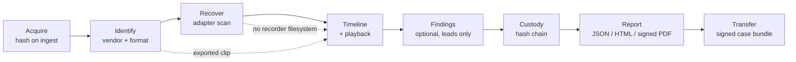
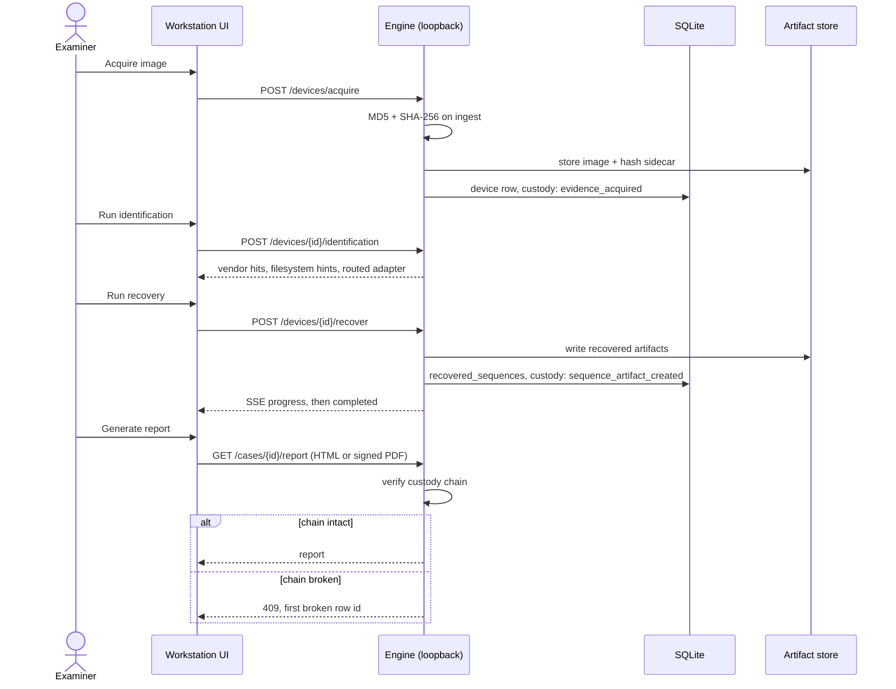
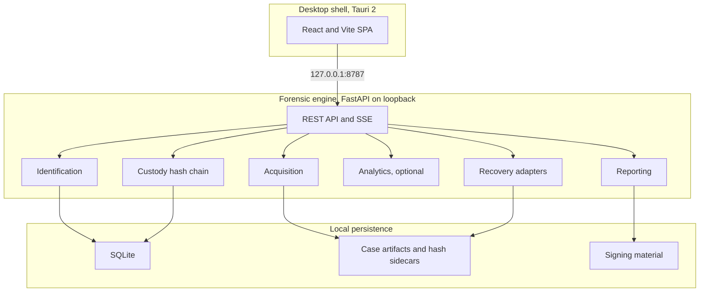
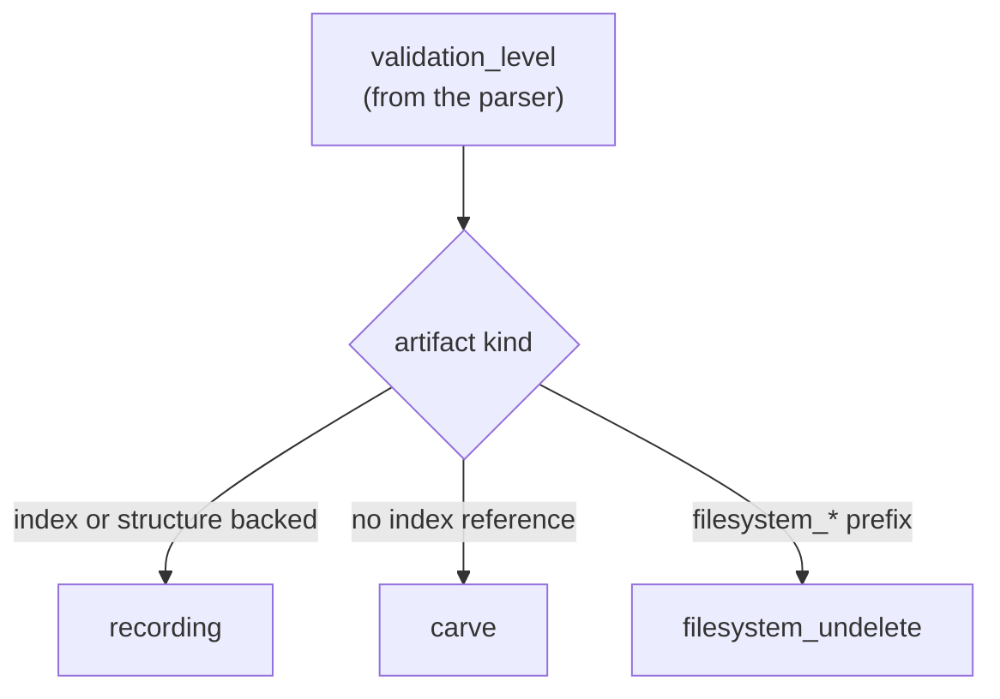

# Pramaan

Multi-vendor DVR and NVR forensic workstation. A local, offline, case-centric
tool for acquiring, identifying, recovering, reviewing, and reporting on
surveillance video evidence from recorders that use proprietary storage layouts.

| | |
|---|---|
| Version | Tracked in `package.json`, `engine/app/__init__.py`, and `src-tauri/tauri.conf.json`; bump with `npm run version:bump` |
| Platform | Windows desktop (Tauri 2 shell + local Python engine) |
| Engine | FastAPI on 127.0.0.1:8787, SQLite, local artifact store |
| UI | React / Vite single-page app |

---

## Contents

- [What Pramaan is, and is not](#what-pramaan-is-and-is-not)
- [Examiner workflow](#examiner-workflow)
  - [A typical case session](#a-typical-case-session)
  - [Failure handling](#failure-handling)
- [Architecture](#architecture)
- [Recovered artifacts: kinds and allocation state](#recovered-artifacts-kinds-and-allocation-state)
- [Vendor support matrix](#vendor-support-matrix)
- [Validation scope](#validation-scope)
- [Quick start](#quick-start)
- [Configuration](#configuration)
- [Validation and testing](#validation-and-testing)
- [Desktop install and packaging](#desktop-install-and-packaging)
- [Repository layout](#repository-layout)
- [API](#api)
- [Version bump](#version-bump)
- [Third-party licenses (summary)](#third-party-licenses-summary)
- [License](#license)

---

## What Pramaan is, and is not

**It is** a single workstation that unifies the steps an examiner would otherwise
run across several vendor tools: image acquisition with hashing, vendor and
format identification, recovery of recordings and deleted footage, a
multi-channel timeline with playback, optional video analytics, an append-only
custody log, and a signed report. Everything runs on the examiner's machine.
The engine listens on loopback only and makes no outbound network calls.

**It is not** a validated forensic suite. The vendor parsers are experimental
(see [Validation scope](#validation-scope)). It does not handle encrypted
volumes, RAID sets, or chip-off dumps. A software read-only open is not a
hardware write blocker. Analytics output is investigative leads for a human to
review, never an identification.

---

## Examiner workflow



1. **Create or import a case.** Registry, then New case, or Import a disk image
   (E01, DD, IMG, RAW, BIN) or a signed case export (`.zip` from another Pramaan
   workstation). Import verifies the manifest signature and every file hash
   before the case opens.
2. **Acquire evidence.** Upload a file, register a file dropped into the
   operator's incoming folder, run disk imaging from a path, or use optional
   logical network acquire (`PRAMAAN_ALLOW_LOGICAL_ACQUIRE=1`). MD5 and SHA-256
   are computed on ingest and written to a sidecar. The acquisition source
   lists load independently; one failing does not blank the others.
3. **Identify.** Review vendor hits, signal strength, filesystem hints, and the
   recovery method the engine routed to. A byte-signature match is a routing
   hint, not proof. Recorder model, serial, and firmware are not available from
   a signature scan and are shown as "Not available from this image". An
   exported clip has no recorder filesystem, so disk-level hints and the
   recovery hand-off are hidden for it.
4. **Recover.** Run a recovery job and watch progress over server-sent events.
   Every recovered row carries an artifact kind (recording, carve, or
   filesystem undelete), a human validation label, a byte range, and an
   allocation state (see
   [Recovered artifacts](#recovered-artifacts-kinds-and-allocation-state)). A
   filesystem-undelete run states its root-directory scope on screen.
5. **Timeline and playback.** Multi-channel timeline that always states its time
   basis on screen: recorder clock with any calibrated drift, or byte-offset
   order when no clock was recovered. Recovered recordings play in the lanes and
   export to MP4 (or raw H.264 without FFmpeg); the same export sits on each
   segment in the Recovery inspector. Each lane reports a readable reason when a
   segment will not play.
6. **Findings.** Optional foreground-motion, scene-change, face-candidate, and
   object analytics plus bounding-box proximity flags. Object findings are
   limited to investigative classes (person, vehicle, bag, and similar) and
   capped per sequence. Investigative aids only; human review required, never
   asserted as fact.
7. **Cross-camera trace.** Correlate the same person across every recovered
   channel and imported clip in the case, by appearance and by face when a face
   is large enough in frame. Each grouping carries a match-confidence badge
   (strong / review / weak) from how tightly its appearances resemble each
   other, and a plain-language movement line on the recorder clock. Upload a
   reference photo to search a completed run. Leads only, human review required.
8. **Custody.** Append-only SHA-256 hash chain with evidence-digest binding.
   When the chain is broken, the first failing row is shown on Overview and
   highlighted on the Custody page.
9. **Report.** JSON, HTML, or PAdES-signed PDF. The standard report is refused
   with HTTP 409 when the custody chain is broken; an integrity report that
   documents the break is still available.
10. **Transfer.** Export a signed case bundle. Importing it on another
    workstation verifies the manifest signature and every file hash.

### A typical case session



### Failure handling

| Symptom | Action |
|---------|--------|
| Port 8787 in use | Stop the stale engine process |
| E01 rejected | Install `libewf-python`, or provide raw / DD |
| No vendor hit | Use the generic Tier 2 path and document the limitation |
| Verification mismatch | Quarantine the copy. Do not continue on a bad hash |
| No recovered segments | Check the adapter and scan scope. This is not proof of absence |
| Playback lane blank | Read the lane message. Code 4 usually means FFmpeg was not available to remux |
| Standard report refused (409) | The custody chain is broken. Use the integrity report and investigate the flagged row |

---

## Architecture



**Trust boundary.** The engine binds to loopback only and makes no outbound
requests. Data lives under `FORENSIC_WORKSTATION_DATA` (default `.localdata/` in
development, `%USERPROFILE%\ForensicWorkstation\data` on Windows). A software
read-only open is not a hardware write blocker.

**Data flow.** Case created, image acquired with MD5 and SHA-256, vendor
detection over the first 64 MiB, adapter scan, sequences placed on the timeline,
custody-verified report, optional signed bundle export and import.

---

## Recovered artifacts: kinds and allocation state

Recovery does not produce one uniform thing. Each recovered row is tagged so the
Overview counts and the Recovery table do not blur them together.



**Artifact kind** answers "what is this row".

| Kind | Meaning |
|------|---------|
| `recording` | Backed by a recorder index or a complete frame structure |
| `carve` | Stream carve with no index reference behind it |
| `filesystem_undelete` | Recovered from a deleted or unallocated filesystem entry; can be small directory debris |

**Allocation state** answers "what does the storage layout say about this row".
It is deliberately separate from whether the recovered bytes are complete.

| State | Meaning |
|-------|---------|
| Allocated | A recorder filesystem index marks the extent as in use |
| Deleted | Recovered from a cleared or expired index entry |
| Structurally complete (no allocation map) | A DHAV dual-signature frame bracket; the DHAV path is a frame carver, so there is no filesystem allocation table to consult |
| Carve (no allocation map) | A stream carve; no allocation map exists for it |
| Unknown | The parser did not report an allocation state and its vocabulary does not imply one |

A row can be allocated and partially overwritten at the same time. "Partial" is
reported on its own axis and never presented as a fourth allocation state.

---

## Vendor support matrix

| Vendor | Level | Route | Note |
|--------|-------|-------|------|
| Dahua | Experimental parser | `dahua_dhav` | FFmpeg-aligned DHAV frame carver; fixture plus optional PRONOM `.dav` (`--real-dvr`) |
| Hikvision | Experimental parser | `hikvision` | HIKBTREE index walk plus MPEG-PS blocks; fixture-tested |
| Honeywell | Experimental parser | `honeywell` | Expired-index heuristic plus format carve; fixture-tested |
| CP Plus | Signature match only | `dahua_dhav` when a DHAV / DHFS family signature is present | The family byte matched; no validated parser ran. Not counted as a vendor identification |
| Uniview | Signature match only | `hikvision` when a HIKBTREE family signature is present | As above |
| TP-Link, Godrej, Matrix | Acquisition plus generic | `generic_tier2` | pytsk3 filesystem undelete or H.264 carve; E01 via pyewf |

**Known limitations.** No encryption, RAID, or chip-off support. Certificates
for the signed PDF and bundle are self-signed by default; use an organisation
PKI for production. The custody actor is client-supplied; bind it to an examiner
session in a hardened deployment. Appearance matching needs roughly 480p or
better source footage. Face matching only works on frames where a face is large
enough to resolve.

---

## Validation scope

Read this before relying on a result.

- The Dahua DHAV, Hikvision HIKBTREE/MPEG-PS, and Honeywell parsers are
  **experimental**. They are proven against in-repo fixtures, an optional PRONOM
  `.dav` sample, and Digital Corpora E01 undelete (`nps-2009-canon2`, at least 6
  deleted root-directory entries via `generic_tier2`). They are **not**
  field-validated against independent recorder disks.
- A CP Plus or Uniview hit means only that a family byte signature was present.
  No validated parser runs for those vendors, so the hit does not count toward
  the Overview "Vendor identified" tally.
- The generic filesystem-undelete pass reads the filesystem root directory only.
  Subdirectories are not walked, and an entry whose directory slot has been
  reused is not recoverable this way.
- Analytics findings and cross-camera matches are investigative leads, not
  identification evidence.
- Cross-camera appearance timestamps come from the decoded frame index over the
  source rate, not from container presentation timestamps.

Fetch public corpora with `scripts/validation/fetch_validation_assets.py`. Place
operator field captures in `validation_data/oem/` (gitignored). The deeper
HIKBTREE layout notes live in `docs/reference/hikvision_fs.md`.

---

## Quick start

### Desktop (recommended)

```powershell
npm install
pip install -r engine/requirements.txt
npm run tauri:dev
```

Starts Vite on `:5173`, the engine on `127.0.0.1:8787`, and opens the Tauri
window.

**SAC-safe path** (when local `tauri build` is blocked by Windows Application
Control):

```powershell
pip install -r requirements-desktop.txt
powershell -ExecutionPolicy Bypass -File scripts/dev/run-desktop-sac-safe.ps1
# or double-click desktop.ps1
```

### Backend only

```powershell
pip install -r engine/requirements.txt
python run.py
```

### Browser UI against a running engine

```powershell
python run.py          # terminal 1
npm run dev            # terminal 2, then open http://localhost:5173
```

---

## Configuration

| Variable | Purpose |
|----------|---------|
| `FORENSIC_WORKSTATION_DATA` | Root data directory |
| `PRAMAAN_OEM_IMAGE_DIR` | Operator drop folder for seized media (default `<data dir>/incoming`, empty on a fresh install) |
| `PRAMAAN_API_TOKEN` | Optional API auth token |
| `PRAMAAN_ALLOW_LOGICAL_ACQUIRE` | Set `1` to enable logical network acquisition |
| `FORENSIC_FFMPEG` | FFmpeg path for MP4 export |
| `FORENSIC_MAX_UPLOAD_BYTES` | Upload cap (default 8 GiB) |

---

## Validation and testing

```powershell
pip install -r engine/requirements-dev.txt   # adds pytest and httpx on top of the runtime deps
python -m pytest engine/tests -q
python scripts/validation/verify_p0.py
python scripts/validation/smoke_test.py       # engine must be running
npx tsc --noEmit
npm run build
python scripts/validation/check_routes.py
```

**Fetch public corpora** (Digital Corpora E01, CAVIAR, tier-1 fixtures, optional
PRONOM Dahua `.dav`):

```powershell
python scripts/validation/fetch_validation_assets.py --real-fs --surveillance
python scripts/validation/fetch_validation_assets.py --real-dvr   # optional PRONOM .dav
python scripts/validation/build_oem_disk_fixtures.py
python scripts/validation/test_public_media.py   # engine on :8787
```

Settings, then **AI models**, can fetch individual manifest entries without the
CLI.

**CI.** GitHub Actions runs the engine tests (Linux, Windows, macOS), the
frontend build, an API smoke test, the PyInstaller sidecar build, and the Tauri
Windows installers on `main`.

---

## Desktop install and packaging

| Path | Command |
|------|---------|
| pywebview (SAC-safe) | `scripts/dev/run-desktop-sac-safe.ps1` |
| Browser plus engine | `scripts/dev/run-desktop-sac-safe.ps1 -Mode browser` |
| Tauri dev | `npm run tauri:dev` |
| Install dependencies once | `npm run desktop:install` |
| Build the engine sidecar | `npm run package:engine:windows` |
| Build installers | `npm run package:windows` |

**CI installers.** Push a `v*` tag or run the workflow manually, then download
the `pramaan-windows-installers` artifact.

Authenticode signing runs when the `WINDOWS_CERTIFICATE_BASE64` and
`WINDOWS_CERTIFICATE_PASSWORD` secrets are configured. Otherwise the artifacts
are unsigned.

---

## Repository layout

```
src/                      React workstation UI
src-tauri/                Tauri 2 shell, capabilities, CSP
engine/                   Python FastAPI forensic engine
  app/api/v1/             REST surface (/api/v1 only)
  app/parsers/            Vendor adapters plus Tier 2
  app/services/           Acquisition, recovery, analytics, custody, reporting
  app/verification/       Builder images used by the parser tests
  tests/                  pytest suite
validation_data/          Fixtures, manifest, optional downloads
docs/reference/           HIKBTREE layout notes, vendored dhav.c
scripts/
  build/                  PyInstaller, Tauri, signing, release
  dev/                    SAC-safe launcher, install helper, version bump
  validation/             Smoke tests, corpora fetch, route check
run.py                    Backend dev launcher
desktop.py                pywebview SAC-safe launcher
```

---

## API

All clients use `/api/v1/*`. Health check: `GET /api/v1/version`. Long-running
work (recovery, analytics, cross-camera, imaging) is a background job with an
SSE event stream at `/api/v1/jobs/{id}/events`.

---

## Version bump

```bash
npm run version:bump -- 0.7.0
```

Syncs `engine/app/__init__.py`, `package.json`, and
`src-tauri/tauri.conf.json`. The version in this README is intentionally not a
hardcoded number; read it from `package.json`.

---

## Third-party licenses (summary)

Direct dependencies include FastAPI, Uvicorn, Pydantic, construct, cryptography,
pyHanko, ReportLab, pytsk3, React, Tauri, Vite, Tailwind, and bundled ONNX
models (YOLOX, YuNet, person_reid_youtu, SFace, all OpenCV Zoo or Apache-2.0
tooling; fetched on demand, not committed). Full license texts live in each
package's repository and installed metadata. Redistribute only after completing
your own license review.

---

## License

See the repository license file when present. Distribution requires an approved
project license and complete third-party notices.
